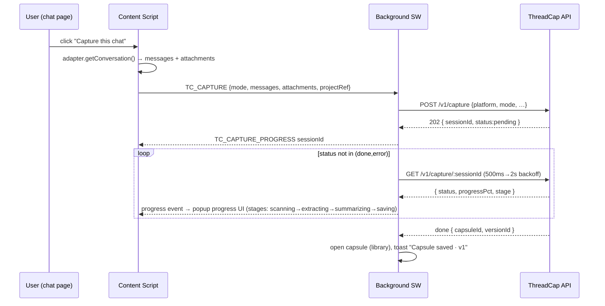
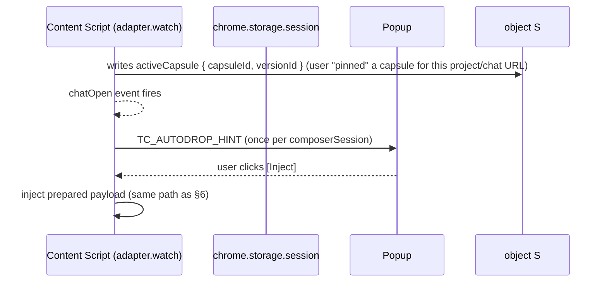

# 05 — Chrome Extension Architecture

## 1. Scope & principles

Manifest **V3** · TypeScript · React (popup) · built with CRXJS + Vite. Targets Chrome (MVP). Must never store the business database locally — the browser is a **thin client over the API** ([01-architecture](/01-architecture.md) §2). Local state is limited to credentials, session cache, pending injections, and UI preferences (matching the privacy model in [08-security-model](/08-security-model.md) §9).

Hard requirements (from review-driven criteria — [09-mvp-acceptance](/09-mvp-acceptance.md)):
- Capture never blocks UI and always shows **progress** (H-REQ-2).
- Injections never duplicate (fingerprint + composer session) and never alter chat style (H-REQ-3).
- Editing a capsule's contents is discoverable and explicit (H-REQ-5).

## 2. Directory layout

```
apps/extension/
├── manifest.json/ts            # MV3 manifest (generated)
├── background/
│   ├── service-worker.ts       # message router, fetch proxy, OAuth refresh, session mgmt
│   ├── auth.ts                 # token store (chrome.storage.local), refresh loop
│   ├── capture.ts              # orchestrates capture pipeline calls
│   ├── injection.ts            # prepare → inject → record (dedupe)
│   └── alarms.ts               # token refresh, cleanup, pending-inject flush
├── content/
│   ├── chatgpt/  ├── injector.ts   ├── harvester.ts
│   ├── claude/   ├── injector.ts   ├── harvester.ts
│   ├── gemini/   ├── injector.ts   ├── harvester.ts
│   ├── gmail/    └── thread-capture.ts
│   ├── common/
│   │   ├── adapter.ts           # PlatformAdapter contract
│   │   ├── composer.ts          # DOM composer helpers
│   │   ├── fingerprint.ts       # composerSession id, dedupe markers
│   │   └── stealth.ts           # stealth/masking utilities
│   └── main.ts                  # adapter dispatch by hostname
├── popup/
│   ├── App.tsx / Library.tsx / CaptureView.tsx / InjectView.tsx
│   └── CookThisPrompt.tsx       # prompt enhancer view
├── shared/
│   ├── rpc.ts                   # typed message envelopes
│   └── types.ts
└── assets/
```

## 3. Message envelope (content ↔ background ↔ popup)

All messaging uses `chrome.runtime.sendMessage` with a typed envelope:

```ts
type TcMessage =
  | { type: 'TC_GET_STATE'; requestId: string }
  | { type: 'TC_CAPTURE'; requestId: string; mode: 'raw'|'smart'
      ; messages: Message[]; attachments: HarvestedAttachment[]; projectRef?: string }
  | { type: 'TC_CAPTURE_PROGRESS'; requestId: string; sessionId: string }
  | { type: 'TC_HARVEST'; requestId: string }                        // content → bg
  | { type: 'TC_PREPARE_INJECT'; requestId: string; capsuleId: string; versionId?: string; mode: InjectMode }
  | { type: 'TC_INJECT'; requestId: string; prepared: InjectionPrepare }
  | { type: 'TC_INJECT_DONE'; requestId: string; injection: { id: string; deduped: boolean } }
  | { type: 'TC_EDIT_VERSION'; requestId: string; versionId: string; content: CapsuleContent }
  | { type: 'TC_ENHANCE_PROMPT'; requestId: string; text: string }   // Cook This Prompt
  | { type: 'TC_OPEN_LIBRARY'; requestId: string };

type TcResponse<T> = { requestId: string; ok: true; data: T }
                   | { requestId: string; ok: false; error: ThreadCapError };
```

Rules:
- Every call has a `requestId` (`req_…`); responses echo it; background proxies to the API and attaches `X-Request-Id`.
- Schemas for all envelopes are exported from `packages/shared-types` (zod).
- The popup never talks to the network directly — **background only** (credentials stay out of renderer where possible; the popup is ephemeral, the SW persists).

## 4. Platform adapter contract

```ts
interface PlatformAdapter {
  readonly id: PlatformId;          // 'chatgpt' | 'claude' | 'gemini' | 'gmail' | 'deepseek' | 'perplexity'
  readonly surface: 'chat' | 'email';
  detect(): Promise<boolean>;       // hostname + DOM probe
  getConversation(): Promise<HarvestResult>;          // messages + attachments
  getComposer(): Promise<ComposerHandle | null>;
  inject(payload: InjectionPayload): Promise<InjectResult>;  // DOM-aware, stealth
  watch(cb: (ev: 'chatOpen'|'threadChange') => void): () => void; // for auto-drop
  supports?: { attachments?: boolean; projects?: boolean };      // GPT/Claude Projects parity
}
```

- Adapters live under `content/<platform>/`; **one adapter per platform**, swapped by `detect()`.
- Gmail adapter implements `getConversation()` as thread → messages (`role: 'user'` for senders, `subject` prepended; `assistant` for matched body), harvesting attachments from the thread; `surface: 'email'`.
- **Project parity**: when a chat is inside a GPT/Claude Project, `getConversation()` returns `projectRef` so the capsule can attach to `projects.external_ref` and re-harvest later.

### 4.1 Selector-free capture & resilience (D-014)
- **Extraction reads the accessibility/text layer** (`aria`/text-tree heuristics) first, CSS classes as a last-resort hint — a platform's class rename does not break `getConversation()`.
- **Remote selector/guard packs** (edge config, versioned, cached 10 min): if a DOM change breaks detection, ops hot-fixes the pack **without an extension release**; `detect()` degrades gracefully.
- **Universal paste-in fallback** (every platform, always available): if detection or extraction fails, the user copies the transcript and pastes it; content script or popup builds the same `HarvestResult` with `source.platform` intact + `captureMode: "paste"`. Same pipeline afterwards. This is also the **mobile/zero-ingest capture path** (see [08-security-model](/08-security-model.md) §9.5).
- **Runtime verdict surface**: adapter returns `confidence` per message (1.0 text-layer, 0.6 selector-hint, 0.3 heuristics); anything below 0.6 routes to the paste-in fallback instead of silently producing a mangled capsule (D-streak: done over ability to scrape).

### 4.2 Adapter-by-adapter behavior matrix

Each adapter implements the `PlatformAdapter` contract (§4) with platform-specific extraction and injection strategies:

| Adapter | `detect()` | `getConversation()` strategy | `getComposer()` | `inject()` | Attachments | Project refs | Auto-drop | Confidence source |
|---|---|---|---|---|---|---|---|---|
| **ChatGPT** | `location.hostname === 'chatgpt.com'` + DOM probe `data-message-author-role` | **Text layer + ARIA**: reads `data-message-author-role` (user/assistant) for role; `innerText` of the message content div. Timestamps from `time[datetime]`. Reactions/tool-calls stripped. | `textarea` or `contenteditable` ProseMirror editor | Pastes as plain text at cursor; waits 100 ms for ProseMirror to accept. Fallback: `execCommand('insertText')`. | ✅ file upload button selector | ✅ project ref from URL `/g/...` | ✅ (pin menu) | 1.0 text-layer; 0.8 aria-hint (prosemirror variant) |
| **Claude** | `location.hostname === 'claude.ai'` + DOM probe `.font-claude-message` | **Text layer**: reads `data-message-role` (user/assistant) + inner text. Timestamps from `time` elements. Tool uses stripped. | `contenteditable` div with `ProseMirror` | Pastes via `clipboardData` simulation; ProseMirror accepts plain text. | ✅ file button | ✅ project ref from URL `/projects/...` | ✅ (pin menu) | 1.0 text-layer; 0.9 prosemirror variant |
| **Gemini** | `location.hostname === 'gemini.google.com'` + DOM probe `.model-response-text` | **Text layer + role heuristic**: reads `.model-response-text` (assistant) vs `.user-text` (user). Timestamps via `aria-label` on message containers. | `rich-textarea` or `contenteditable` | Pastes as plain text; waits for `input` event confirmation. | ✅ file picker | ⚠️ partial (workspace ref from URL) | ✅ (pin menu) | 0.9 text-layer; 0.7 heuristic role |
| **Gmail** | `location.hostname === 'mail.google.com'` + DOM probe `.n3nP9c` (thread body) | **Thread → messages**: parses thread subject from `hP`; each message body from `.a3s` div; role from sender name vs user's account. Attachments from `.aZo` list. | N/A (no compose injection) | N/A (capture-only) | ✅ thread attachments | ⚠️ partial (label from thread) | N/A | 1.0 text-layer; 0.8 sender heuristic |
| **DeepSeek** | `location.hostname === 'chat.deepseek.com'` + DOM probe `.ds-markdown` | **Text layer**: reads `.message-content` with role from `data-role`. Timestamps from `time` element. | `textarea` | Plain text paste | ❌ | ❌ | ❌ | 0.9 text-layer |
| **Perplexity** | `location.hostname === 'perplexity.ai'` + DOM probe `[data-testid="answer-text"]` | **Text layer**: answer text from `[data-testid="answer-text"]`, question from `[data-testid="user-query"]`. Follow-up links stripped. | `textarea` | Plain text paste | ❌ | ❌ | ❌ | 0.8 text-layer; 0.6 heuristic role |
| **Paste-in (universal)** | Always available (button in popup) | **Clipboard content**: user pastes transcript; parser splits by blank lines or numbered messages; role detected by "You:" / "Assistant:" prefix or LLM heuristic. | N/A (capture-only) | N/A | ✅ file drop zone in popup | ❌ | N/A | N/A (user-verified) |

**Notes on the matrix:**
- **"text-layer"** = DOM accessibility/text content extracted without CSS selectors; resists UI redesigns.
- **"heuristic"** = class names, ARIA attributes, or structural patterns used as a secondary signal when text-layer alone is ambiguous.
- **Project ref** = the adapter extracts an external project/workspace identifier from the URL or DOM so the capsule can be auto-pinned to that project in ThreadCap.
- **Auto-drop** = the adapter supports `watch()` + `chatOpen` event so the auto-drop hint fires when a pinned project's chat is opened.

### 4.3 Selector strategy per platform (D-014 detail)

The selector-free principle means extraction **always starts with the text/accessibility layer** and only falls back to CSS selectors as a hint. Here is the concrete per-platform strategy:

**ChatGPT (`content/chatgpt/harvester.ts`):**
```
Primary: [data-message-author-role] → role (user|assistant)
         .textContent → message body
         time[datetime] → timestamp
Fallback (edge config selector pack): 
         .markdown → body (when role attr removed)
         .whitespace-pre-wrap → body
Guard:   if (!document.querySelector('[data-message-author-role]')) → confidence = 0.3 → paste-in
```

**Claude (`content/claude/harvester.ts`):**
```
Primary: [data-message-role] → role (user|assistant)
         .font-claude-message → body text
         time → timestamp
Fallback: div[data-is-streaming] → ongoing message
          .prose → body (when class renamed)
Guard:   if (!document.querySelector('[data-message-role]')) → paste-in
```

**Gemini (`content/gemini/harvester.ts`):**
```
Primary: .model-response-text → assistant body
         .user-text → user body (heuristic: closest ancestor has role indicator)
         [aria-label*="message"] → container with timestamp
Fallback: .response-container → body (new class)
Guard:   if neither .model-response-text nor .user-text found → paste-in
```

**Gmail (`content/gmail/thread-capture.ts`):**
```
Primary: .n3nP9c (thread container) → subject
         .a3s → message body
         .gD (sender name) → role (compare to user account name)
         .aZo → attachment list
Fallback: [role="list"] li → message list
Guard:   if thread container not found → paste-in
```

**Remote selector pack format** (edge config, versioned):
```json
{
  "platform": "chatgpt",
  "version": 3,
  "updatedAt": "2026-10-01T00:00:00Z",
  "selectors": {
    "messageContainer": "[data-message-author-role]",
    "roleAttribute": "data-message-author-role",
    "bodySelector": ".markdown",
    "timestampSelector": "time[datetime]"
  },
  "guards": {
    "minMessages": 1,
    "roleValues": ["user", "assistant"]
  }
}
```
- Packs are fetched on extension install + every 10 minutes; cached in `chrome.storage.local` under `tc.selectorPacks`.
- A broken selector triggers an automatic fallback to the paste-in flow + an ops alert.

### 4.4 Universal paste-in fallback — expanded flow (D-014)

The paste-in fallback is always available (every platform, every state) and serves as the safety net when auto-detection fails, the platform redesigns its DOM, or the user is on mobile/untrusted environments.

**User flow:**
```
1. User copies the chat transcript (Ctrl+A, Ctrl+C on the page, or exports).
2. User opens ThreadCap popup → "Paste transcript".
3. Popup shows a paste area:
   ┌──────────────────────────────────────┐
   │ Paste your chat transcript here      │
   │ ┌──────────────────────────────────┐ │
   │ │ (paste area — Ctrl+V)            │ │
   │ └──────────────────────────────────┘ │
   │ Source: [ChatGPT ▾]                  │
   │ ☑ Auto-detect roles from prefixes    │
   │ [Parse → Capture]                    │
   └──────────────────────────────────────┘
4. Parser splits by:
   - Blank line between messages, OR
   - Numbered messages (1. ... 2. ...), OR
   - "You:" / "Assistant:" / "User:" / "AI:" prefixes
5. Role assignment:
   - Prefix-based ("You:" = user, "Assistant:" = assistant) → confidence 0.9
   - LLM heuristic (if no prefixes found) → confidence 0.5 (user confirms in review)
   - User can manually reassign roles in the review step
6. Review step:
   ┌──────────────────────────────────────┐
   │ Parsed 14 messages from ChatGPT      │
   │ msg 1: user · "What is the loan..."  │
   │ msg 2: assistant · "The loan min..." │
   │ [Edit] [Merge] [Split] [Delete]      │
   │ ☑ Auto-extract requirements/decisions│
   │ [Continue → Capture pipeline]        │
   └──────────────────────────────────────┘
7. From here, the standard capture pipeline runs (§5): smart extraction → save → done.
```

**Paste-in always sets:**
- `source.platform` = the user-selected platform (ChatGPT, Claude, etc.)
- `captureMode = "paste"`
- No `projectRef` (user can manually pin after capture)
- No attachments (user can drag files into the paste area)

**Edge cases:**
- Very large transcripts (> 500 messages): warn the user, offer to trim to the last 500 messages or split into multiple capsules.
- Mixed-language transcripts: the parser handles any language; role detection is language-agnostic (prefix patterns + heuristic).
- HTML-formatted paste (rich text): the parser strips HTML tags, preserving only text content.

## 5. Capture pipeline (progress, never a hang)

Sequential stages surfaced through `GET /v1/capture/:sessionId` and mirrored in the popup:



- `raw` capture skips `extracting`/`summarizing` (progress jumps to `saving`); `smart` runs the AI pass server-side.
- The popup progress view (see [07-ux-screens](/07-ux-screens.md) §8) has: current stage label, progress bar, token/size estimate, Cancel (marks session cancelled; worker stops).
- On failure, the session exposes `error.code` (`CAPTURE_FAILED`, `TOO_MANY_ACTIVE`, `TRIAL_EXPIRED`) and the popup offers Retry.

### 5.1 Zero-player capture hygiene (D-019, countermeasure C-5)
Session bloat is prevented **at the moment of creation**, not later:
- **Auto-name**: default capsule name = transcript title or first-user-message head (≤ 9 words); no `Untitled-12` ever.
- **Auto-tag**: captured `platform` + detected project/folder derive a primary tag; human override kept one click away.
- **Related-capsule suggestion**: before save, `POST /v1/capsules/related` scores existing capsules (name+summary embedding); if top hit > threshold, popup asks "**Update Ecoru Revamp (v7) instead of creating a new capsule?**" (Yes → new_version path, no → create).
- **Continuation pattern**: `/capsule-save` into a busy tag prompts *"latest on this tag is 40 min old"* so hopping sessions chain to the right capsule version.

## 6. Injection flow

```mermaid
sequenceDiagram
    participant U as User
    participant P as Popup
    participant C as Content Script
    participant B as Background SW
    participant G as ThreadCap API

    U->>P: open library → choose capsule → Inject
    P->>B: TC_PREPARE_INJECT {capsuleId, versionId, mode}
    B->>G: POST /v1/injections/prepare {target, composerSession}
    G-->>B: payload + tokenEstimate + fingerprint
    B-->>P: show Inject Preview (token footer, include toggles)
    U->>P: [Inject]
    P->>C: TC_INJECT {prepared}
    C->>C: composer.focus(); write payload as isolation-preamble (stealth)
    C-->>P: TC_INJECT_DONE (client marker set)
    P->>B: record → POST /v1/injections (fingerprint)
    B-->>P: 201 {injection, deduped:false} | 409 INJECTION_DUPLICATE
```

### 6.1 Modes
| Mode | Payload | Notes |
|---|---|---|
| `full` | Complete structured context (all sections + attachments list) | default |
| `summary` | `summary` + top requirements/decisions | cheap, fast |
| `smart` | Dynamic-context filter: only relevant sections (Team tier) | server-side RAG select |
| `custom` | User toggles include set | per-injection overrides |

### 6.2 Deterministic isolation-preamble (H-REQ-3)
Injected text uses a **stable, prefixed block** so the host doesn't mis-tag it as continuation or reflow style:

```
── CAPSULE CONTEXT · Ecoru Revamp · v4 ─────────────────
GOAL: …
REQUIREMENTS:
…
DECISIONS:
…
CONTEXT TOKENS: 3,821 · ThreadCap · <capsuleId> · <versionId>
─────────────────────────────────────────────────
```
- The footer includes the token count (user sees the real cost) and is **IMPORTANT/context block** only — no system-prompts that host models might treat as directives (avoids "changed my conversation style" and lost tokens).
- **Stealth**: markers like IDs are minimized; masking strips screenshot-exposed metadata (`sourceTool`, capturer email) before injection when `prefs.stealthInjection`.

**Context block design rules — anti "lost in the middle" (C-3):**
- **Front-load importance**: within the block, sections emit objective → decisions → requirements → constraints/assumptions → rest. The receiving model has the strongest area-weighted signal at the first 1–2 sections after the preamble.
- **Flat, single depth**: no nested sub-lists deeper than one level; no walls of unbroken prose. Long requirements render as `N. <verb phrase> (<status>)` lines.
- **One instruction header, nothing more**: the only directive text is the `GOAL:` line; everything else is declarative data (avoids the model psychending "instructions" buried mid-block).
- **The user's message stays adjacent**: the block is written as a compose-then-submit action at the current cursor right before the user's own first message, keeping the new instruction the newest signal.

### 6.3 Duplicate prevention (H-REQ-1)
- `composerSession` is a UUID written into `chrome.storage.session` per chat open, cleared on inject.
- fingerprint = `SHA-256(version.content_hash | target | composerSession)`.
- Content script also sets a DOM sentinel (`data-threadcap-injected="<fingerprint>"`) on the composer for same-page protection and removes it only on manual user edit or refresh.
- Popup shows "Already injected here — Reinject?" on `409 INJECTION_DUPLICATE` (new composerSession).

### 6.4 Purpose-driven briefs & token budget (D-012, countermeasure C-1/C-2)
Injection is **never total recall by default**. User picks a *purpose* and a *token budget*; the server renders the smallest section-set that serves it:

| Purpose | Payload |
|---|---|
| `recap` | `summary` + objective + open decisions/requirements |
| `handoff` | objective + requirements + decisions + constraints + open questions (no talk) |
| `review` | objective + requirements + decisions + attachments list + current version diff |
| `build` | decisions + constraints + assumptions + requirement statuses + links |
| `full` | complete structured context (still opt-in, with budget warning) |

- **Budget = contract**: `POST /v1/injections/prepare` takes `{ purpose, maxTokens }`; server returns payload sized under that cap or an explicit `BUDGET_EXCEEDED` with the cheapest viable variant (e.g. `recap` at 1,200 tokens) plus the excluded-sections list.
- **Deepen-on-demand**: after a brief inject, the compose menu offers **"+ Insert <section>"** at the current cursor — one follow-up injection, fingerprint-recorded per section, so total context grows only as far as the conversation needs.
- Rendered briefs use the same deterministic preamble + token footer (§6.2) so the host still sees a clean, marked, single block.
- Token triage shown in the preview (§[07](/07-ux-screens.md) §7): estimated cost, budget cap used, and "what's excluded".

**Attach-as-file mode (D-017, countermeasures C-2/C-3):** when the target host supports reference files (ChatGPT attachments, Claude project docs, Gemini file picker), the composer flow offers **Attach rather than paste**. ThreadCap produces a `.context.md` brevity block (front-loaded, objective-first, ~1/3 of full size) written into the host's file picker; the model reads it as a **reference document**, not re-billable per-message prompt text — the honest, platform-native equivalent to background project files. Inline paste remains for hosts without native files.

## 7. Auto-Drop (differentiator)


- A capsule can be **pinned per project-ref** (`epin: {projectRef: capsuleId}`) from the popup or library → next chat open in that project offers one-click inject (no drag, no search).
- **Only once per composerSession** — respects privacy and the no-duplicate rule.

## 8. Edit / update a capsule's contents (H-REQ-5)

The complaint "unclear how to update the contents" is answered with an explicit **Edit version** flow available in popup + chat page + web app:

- From popup: capsule menu → **Edit contents** → opens a section editor (objective/requirements/decisions/… + conversation preview) → `PUT /v1/versions/:current` → creates vN+1 with auto change summary.
- **Rollback**: menu → Version history → pick version → **Restore this version** → `POST /v1/versions/:id/rollback`.
- Live chat capture into the same capsule: `target.action = new_version`, auto `changeSummary: "Extended from <platform> chat"`.

### 8.1 Live capsules: consented auto-refresh (D-013, countermeasure C-3)
Fixes "context rot / re-capture everything by hand":

- User enables **Keep this capsule updated** (popup pin menu or capsule detail) for a capsule pinned to a project ref.
- On **chat close** (or explicit refresh) the content script runs a **re-harvest** through `POST /v1/capture { target: { capsuleId }, mode: smart|raw, refresh: true }` → creates **vN+1** (immutability holds, D-005), never a silent overwrite.
- API returns `driftDiff`: sections/messages added, changed, or removed since last capture + auto `changeSummary` from the diff.
- Default **off**; requires per-chat consent; visible in Settings → Preferences as a privacy control; respects the same dedupe fingerprint (a re-harvest that yields `content_hash` identical to the current version is skipped as `CAPSULE_UNCHANGED`).
- **Manual override everywhere**: the popup "Update capsule" button forces a refresh with progress; so does `/capsule-version` in [06](/06-mcp.md) §7.

## 9. Cook This Prompt (prompt enhancer)

- From chat page: select text → context-menu → **Enhance with ThreadCap**; or popup → "Cook This Prompt".
- `POST /v1/prompts/enhance` `{ "text", "purpose"?, "tone"? }` → `{ enhanced, diff, tokenEstimate }`.
- User can then route the enhanced prompt to a capsule (capture) or inject directly.
- Guard: `purposes` whitelist (general, requirements, code-review, technical-writing); never rewrites code verbatim without user confirm. (V1; endpoint stubbed in [openapi.yaml](/openapi.yaml) as future.)

## 10. Local storage model

| Store | Keys | Notes |
|---|---|---|
| `chrome.storage.local` | `tc.token`, `tc.refresh`, `tc.tokensUpdatedAt`, `tc.email`, `tc.prefs`, `tc.recent` | credentials + prefs + recent capsules cache (cleared on logout) |
| `chrome.storage.session` | `tc.composerSession`, `tc.pendingInject`, `tc.activeCapsule` | per-tab/session, cleared on close/refresh |
| `chrome.storage.local`| `tc.captureSessions` | short-lived progress snapshots, pruned by alarm |

Token refresh runs on SW alarm (≥ 4 min before expiry); offline queues a single capture → retried on `online` event.

## 11. Permissions (MVP manifest)

`host_permissions`: the supported chat/email hosts + `https://api.threadcap.app/*`. Content scripts injected on match patterns only. No `<all_urls>`. `permissions`: `storage`, `alarms`, `contextMenus` (Cook This Prompt), `identity` not required (OAuth handled server-side exchange). `web_accessible_resources`: SDK assets only.

### 11.1 Blocker-safe scripting posture (D-018, countermeasures C-11/C-12)
Ad-blockers, uBlock, Brave shields, and enterprise policies frequently block content scripts that ingest page data — ThreadCap eliminates the causes instead of asking users to allowlist:

- **Inert until gesture**: content scripts register a **registered declarative** match but execute **no DOM reads until the user clicks Capture/Inject**; no `MutationObserver`, no polling timers, no runtime `eval`.
- **Isolated world only**: all script execution is `world: 'ISOLATED'`; never `MAIN` — avoids CSP/cross-origin conflicts and reduces the hostile-script fingerprint.
- **Background-only network**: all fetches (API, presigned URLs, capture polling) happen in the service worker; content scripts make **zero network requests** — ad-blockers targeting web requests have nothing to block.
- **On-demand `chrome.scripting.executeScript`** instead of eager `content_scripts.run_at: document_start` where possible (background SW detects URL, triggers on first user action). This avoids the script-injection lifecycle that script blockers flag.
- **Graceful read-only fallback**: if content scripts are fully blocked by policy, the popup/library/MCP surfaces are fully functional; capture/inject degrade to paste-in; the extension still works — just without auto-detection.
- **Permission disclosure UI** (first-run popup): a clear, one-sentence disclosure: *"ThreadCap reads the chat page only when you click Capture or Inject. It never reads in the background, tracks your browsing, or sends data except when you choose to save or inject."*
- **declarativeContent** for tab detection instead of content-script page probing when feasible.

## 12. Manifest MV3 notes
- Service worker is module (`"type": "module"`); idle/event loops kept short; long work (capture polling) uses alarms + periodic local writes, never long-lived timers.
- CSP strict; no remote code; bundled React popup.

## 13. Cross-cutting validation
Envelope schemas, adapter outputs, and payload examples are validated against `packages/shared-types`. Capture payloads must satisfy [03-capsule-schema](/03-capsule-schema.md) §3 message contract. Acceptance gates in [09-mvp-acceptance](/09-mvp-acceptance.md) §3 (H-REQ-1..5, H-REQ-9, H-REQ-10).